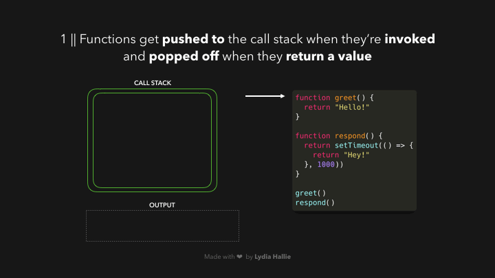

# The Heap, Stack, Event Loop, Callback Queue and More

### Notes from Philip Roberts' talk "What is the event loop anyway?", JSConfEU 2014

## Resources:

- [MDN on this subject](https://developer.mozilla.org/en-US/docs/Web/API/HTML_DOM_API/Microtask_guide/In_depth)
- ["What is the Event Loop Anyway"](https://youtu.be/8aGhZQkoFbQ)
- [Lydia Hallie's JavaScript Visualized: The Event Loop](https://dev.to/lydiahallie/javascript-visualized-event-loop-3dif)

## The Heap and the Call Stack

Philip starts with the heap and the stack. They seem to be counterparts in some way.

The **heap** is where memory allocation occurs. That's about all that's said about it in Philip's talk.

The **call stack** is a data structure that records where in a program we are. Picture a stack of pancakes. The first pancake added to the stack is the last pancake to get eaten. First in, last out. When we call a function, we push that function onto the top of the stack. When that function returns, it is popped off the top of the stack. But what if our function calls other functions? Those functions will also be added to the call stack, on top of the function that called them. That becomes clearer below.

```js
// Pseudo code
function myFunc1 {
    return "Yay!";
}
function myFunc2 {
    myFunc1();
}
function myFunc3 {
    myFunc2();
}

myFunc3()
```

Here's what's happening:

1. When we call myFunc3, we add it to the top of the call stack.
2. myFunc3 calls myFunc2, so we add that to the call stack as well, on top of myFunc3.
3. myFunc2 calls myFunc1, so we add myFunc1 to the call stack as well, on top of myFunc2.
4. myFunc1 returns the string "Yay!", and is then popped off the top of the stack.
5. That means that myFunc2 has now completed as well, since all it did was call myFunc1. So, myFunc2 is popped off the top of the stack next.
6. Finally, now that myFunc2 has completed, myFunc3 is completed as well, since all it did was call myFunc2. So, myFunc3 can be popped off the top of the stack.

How does the runtime know that a function has completed? Reaching a return statement signals that a function is complete. But even without an explicit return statement, the runtime can figure out that a function has completed.

The stack is important in understanding the concept of "**blocking code**." JS can only perform one task at a time (it's a "**single threaded**" language). What that means is that if a function takes a while to execute, nothing else can happen until that function completes its execution. You can imagine a slow running function sitting on the top of the stack, waiting to complete, so that it can be popped off, and the runtime can return to the function below it. In a browser, that can lead to the UI freezing while a function executes.

The stack does not have infinite capacity. You may have heard of "**blowing the stack**." That occurs when you recursively invoke a function forever. Eventually, the stack runs out of room to add more functions - that's "blowing the stack."

When we inspect an error in the console, the call stack allows us to view a history the functions that were called that led to our error. This is called a "**stack trace**."

The V8 runtime manages the heap and stack, but the runtime is not what enables various APIs, not even simple things like setTimeout. Where do these things come from then? These APIs are implemented by the browser.

## The Callback Queue and the Event Loop

If JS is single-threaded, how does it handle asynchronous functions like callbacks and setTimeout()? It uses a callback queue and an event loop. When an async function is added to the top of the call stack, an appropriate web API will divert it to the callback queue. Whenever the call stack is empty, the event loop takes the first item that was added to the callback queue and adds it back to the call stack. This is difficult to understand without animating the process. Philip does a great job of that in his talk at around the [13 minute mark](https://www.youtube.com/watch?v=8aGhZQkoFbQ&list=PLe_XhrA8jJwoRZA3GqD9K9MXZWFIgULLY&index=5&t=45s). Basically, the whole last 10 minutes of his talk is an animation and demonstration of this process. Lydia Hallie has also created [a series of animated gifs](https://dev.to/lydiahallie/javascript-visualized-event-loop-3dif) to illustrate the process.




## Tasks and Microtasks

